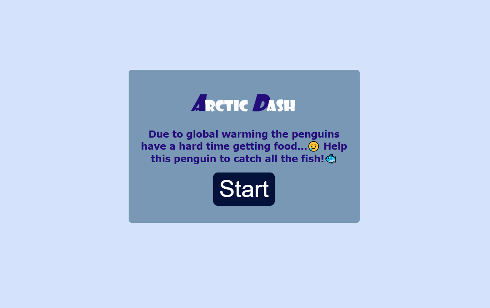
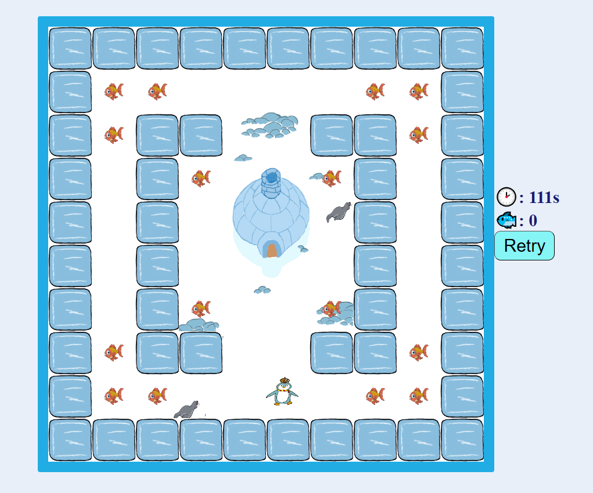
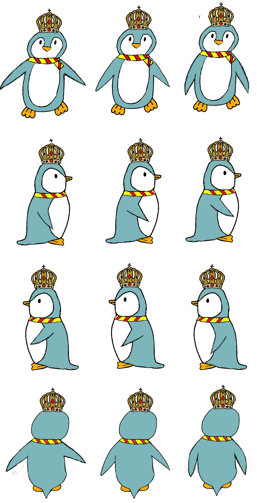
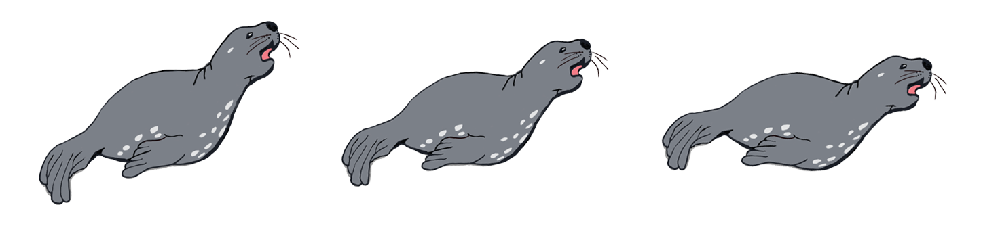
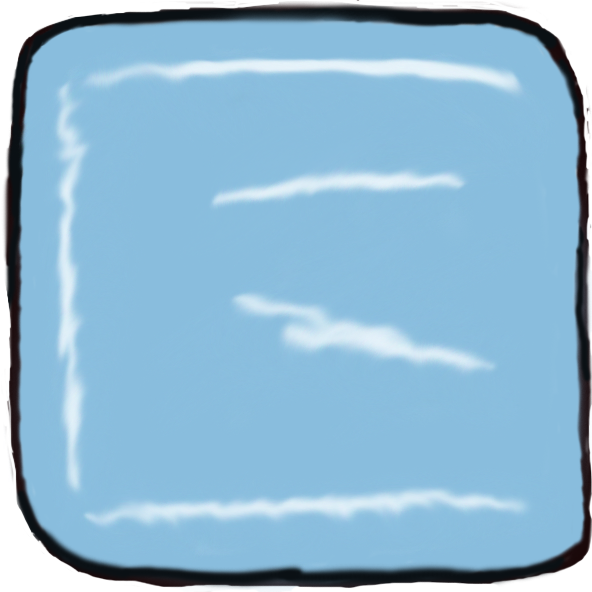
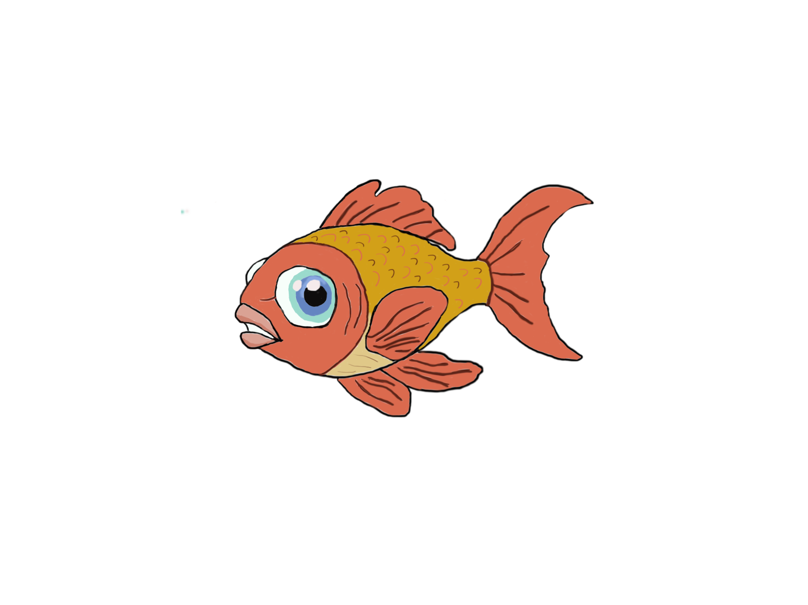

# CCL1
# 🎮 Arctic Dash

< Dive into an exciting adventure with your penguin in this fast-paced game! Your goal is simple: collect all the < fish while avoiding the enemy. Race against the clock to gather every fish before time runs out, but be careful—< if the enemy catches you, it’s game over! 

### Menu:

  
  
*Menu*

### Gameplay:

  
  
*Example of gameplay action.*

### Character:

  
  
*Player character animations.*

### Enemies:

  
  
*Enemy animations.*

### Object:

  
  
*Picture about the wall in the game.*

### Collectible:

  
  
*Picture about the collectible items.*

---

## ✍️ **Reflection**

### What went well:
- I delivered a playable game.
- The drawings turned out to be better than I expected.
- I'm good at bug fixing.

### Challenges:
- I had some implementation problems.
- I don't really like the design.

### Lessons Learned:
- Don't be ashamed to ask for help.
- The spritesheet needs to be even.
